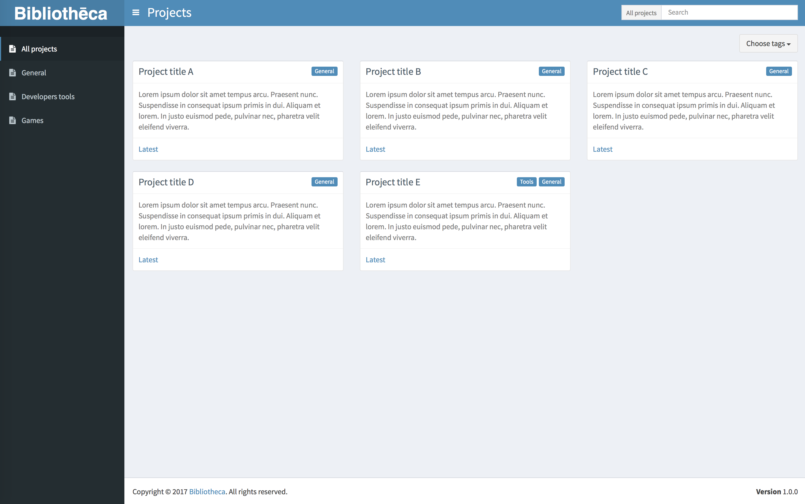
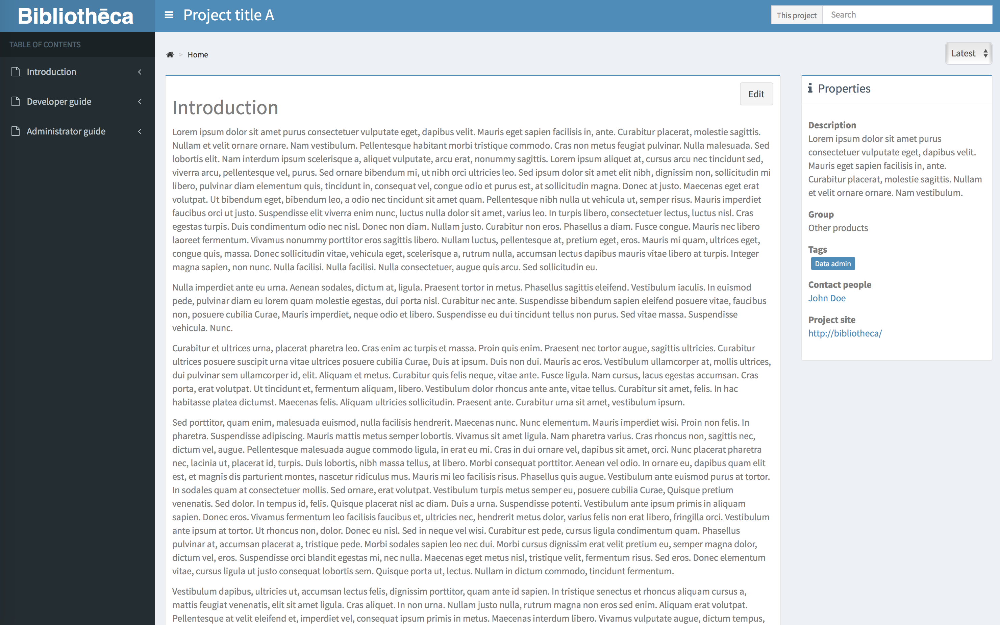
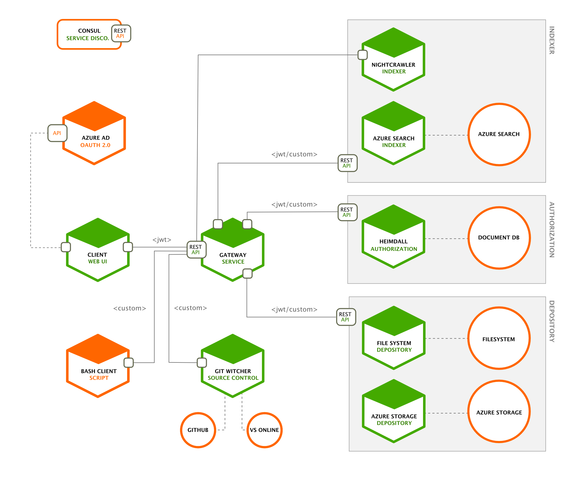

Bibliothēca is a web application which can show Markdown files from projects as a html pages. Whole idea is very similar to ReadTheDocs however application is created in C# (.NET Core applications).

## Screenshots

 

## Architecture

Application is diviaded for a few microservices. Most of the application was created as a ASP.NET Core 1 Web application. Client application is Angular 2 application.

## Continuous Integration

### Services

{: .table .table-striped}
| project                                                                                                                     | branch  | status                                                                                                                                                                                                                                    |
|-----------------------------------------------------------------------------------------------------------------------------|---------|-------------------------------------------------------------------------------------------------------------------------------------------------------------------------------------------------------------------------------------------|
| [Bibliotheca.Server.Gateway](https://github.com/BibliothecaTeam/Bibliotheca.Server.Gateway)                                 | master  |                                    |
|                                                                                                                             | develop |                                  |
| [Bibliotheca.Server.Indexer.AzureSearch](https://github.com/BibliothecaTeam/Bibliotheca.Server.Indexer.AzureSearch)         | master  |            |
|                                                                                                                             | develop |          |
| [Bibliotheca.Server.Indexer.Nightcrawler](https://github.com/BibliothecaTeam/Bibliotheca.Server.Indexer.Nightcrawler)       | master  |          |
|                                                                                                                             | develop |        |
| [Bibliotheca.Server.Depository.AzureStorage](https://github.com/BibliothecaTeam/Bibliotheca.Server.Depository.AzureStorage) | master  |    |
|                                                                                                                             | develop |  |
| [Bibliotheca.Server.Depository.FileSystem](https://github.com/BibliothecaTeam/Bibliotheca.Server.Depository.FileSystem)     | master  |        |
|                                                                                                                             | develop |      |
| [Bibliotheca.Server.Mvc.Middleware](https://github.com/BibliothecaTeam/Bibliotheca.Server.Mvc.Middleware)                   | master  |                      |
|                                                                                                                             | develop |                    |
| [Bibliotheca.Server.ServiceDiscovery](https://github.com/BibliothecaTeam/Bibliotheca.Server.ServiceDiscovery)               | master  |                  |
|                                                                                                                             | develop |                |
| [Bibliotheca.Server.SourceControl.GitWitcher](https://github.com/BibliothecaTeam/Bibliotheca.Server.SourceControl.GitWitcher) | master  |       |
|                                                                                                                             | develop |     |
| [Bibliotheca.Server.Authorization.Heimdall](https://github.com/BibliothecaTeam/Bibliotheca.Server.Authorization.Heimdall)   | master  |      |
|                                                                                                                             | develop |    |

### Libraries

{: .table .table-striped}
| project                                                                                                                     | branch  | status                                                                                                                                                                                                                                    |
|-----------------------------------------------------------------------------------------------------------------------------|---------|-------------------------------------------------------------------------------------------------------------------------------------------------------------------------------------------------------------------------------------------|
| [Bibliotheca.Server.Mvc.Middleware](https://github.com/BibliothecaTeam/Bibliotheca.Server.Mvc.Middleware)                   | master  |                      |
|                                                                                                                             | develop |                    |
| [Bibliotheca.Server.ServiceDiscovery](https://github.com/BibliothecaTeam/Bibliotheca.Server.ServiceDiscovery)               | master  |                  |
|                                                                                                                             | develop |                |

## Nugets

{: .table .table-striped}
| assembly                                          | nuget                                                                                                                                                                               |
|---------------------------------------------------|-------------------------------------------------------------------------------------------------------------------------------------------------------------------------------------|
| Bibliotheca.Server.Mvc.Middleware.Authorization   |      |
| Bibliotheca.Server.Mvc.Middleware.Diagnostics     |        |
| Bibliotheca.Server.ServiceDiscovery.ServiceClient |  |

## Getting started

To run application lcally you have to configure few environment variables. All of them are described below.

### Service discovery

